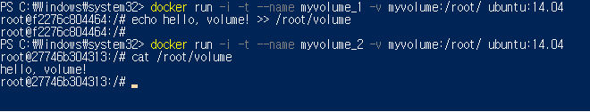

# 도커 볼륨
- 도커 이미지로 컨테이너를 생성하면 이미지는 읽기 전용이 되며 컨테이너의 변경 사항만 별도로 저장해서 각 컨테이너의 정보를 보존한다.
- 이미 생성된 이미지는 어떠한 경우로도 변경되지 않으며, 컨테이너 계층에 원래 이미지에서 변경된 파일시스템 등을 저장한다.
- **그러나, 컨테이너를 삭제하면 컨테이너 계층에 저장되어 있던 데이터베이스의 정보도 삭제된다.**
  - 이를 방지하기 위해 볼륨을 활용한다.
    1. 호스트와 볼륨을 공유
    2. 볼륨 컨테이너를 활용
    3. 도커가 관리하는 볼륨을 생성 (추천)

## 1. 호스트 볼륨 공유
    -v [호스트의 공유 디렉토리]:[컨테이너의 공유 디렉토리]
- -v 옵션을 사용해서 호스트에 공유 디렉토리가 생성된다.
  - 즉, 컨테이너의 파일이 호스트로 복사된다.

## 2. 볼륨 컨테이너
    --volume-from [-v 옵션을 사용하는 컨테이너]
- '볼륨 컨테이너'로서 호스트에서 볼륨만 공유하고 별도의 역할을 담당하지 않는다.

## 3. 도커 볼륨 (추천)
    docker volume [명령어]
- 도커 자체에서 제공하는 볼륨 기능을 활용해 데이터를 보존한다.

### 볼륨 생성
    docker volume create --name [이름]

### 생성된 볼륨 확인
    docker volume ls

### 볼륨을 사용하는 컨테이너 생성
    -v [볼륨의 이름]:[컨테이너의 공유 디렉토리]

## 결과 확인!
