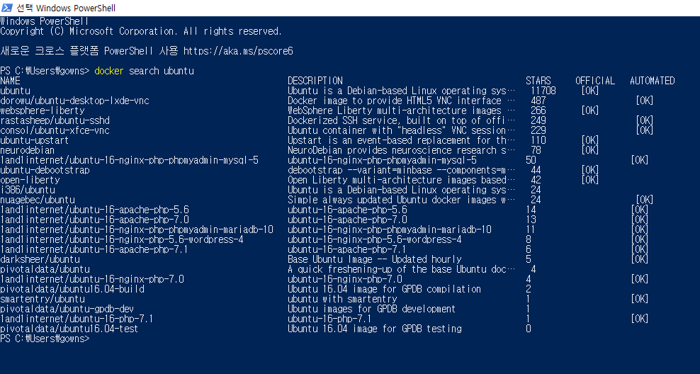

# 도커 이미지
- 도커는 일반적으로 '도커 허브'라는 중앙 이미지 저장소에서 이미지를 내려받는다.
- 도커 허브는 누구나 이미지를 올릴 수 있기 때문에, 공식(Official) 라벨이 없는 이미지는 사용법을 찾을 수 없거나 제대로 동작하지 않을 수 있다.
- `docker search [이미지 이름]` 명령어로 도커 허브에 있는 이미지를 검색할 수 있다.

## 1. 도커 이미지 생성
    docker commit [옵션] [이미지로 만들 컨테이너 이름] [이미지 이름:태그]
- 컨테이너에 애플리케이션을 위한 특정 개발 환경을 직접 구축한 뒤, 사용자만의 이미지를 생성해야 하는 경우가 많다.
- 이미지의 태그를 입력하지 않으면 자동으로 latest로 설정된다.
- 옵션
  - `-a`
    - author
    - 이미지의 작성자를 나타내는 메타데이터를 이미지에 포함시킨다.
  - `-m`
    - message
    - 커밋 메시지를 뜻하며, 이미지에 포함될 부가 설명을 입력한다.

## 2. 이미지 구조 이해
- `inspect` 명령어로 이미지의 레이어(Layers)를 볼 수 있다.
- 이미지를 커밋할 때 컨테이너에서 변경된 사항만 새로운 레이어로 저장하고, 그 레이어를 포함해 새로운 이미지를 생성하기 때문에 전체 이미지의 실제 크기는 [원본 이미지 크기] + [커밋한 파일의 크기]이다.
  - 커밋한 파일은 이미지를 생성할 때 사용했던 컨테이너에서 변경된 사항이다.
- 원본 이미지를 커밋한 이미지가 있는 경우, 원본 이미지를 삭제해도 실제로 원본 이미지의 레이어 파일이 삭제되지는 않는다.
  - 레이어에 부여된 이름만 삭제한다.
  - 이 경우 **Untagged: ...** 메시지가 출력된다.

## 3. 이미지 추출
    docker save [옵션] [이미지 이름]
    docker load [옵션]
- 필요에 따라 이미지를 단일 바이너리 파일로 저장해야 할 때가 있다.
- `save` 명령어로 컨테이너의 커맨드, 이미지 이름과 태그 등 이미지의 모든 메타데이터를 포함해 하나의 파일로 추출할 수 있다.
  - `-o` 옵션에는 추출될 파일명을 입력한다.
  - 예) `docker save -o ubuntu_14_04.tar ubuntu:14:04`
- 추출된 이미지는 `load` 명령어로 도커에 다시 로드할 수 있다.
  - 예) `docker load -i ubuntu_14_04.tar`

## 4. 이미지 배포
- 이미지 파일의 크기가 너무 크거나 도커 엔진의 수가 많다면, save와 같은 방법으로 이미지를 파일로 배포하기가 어렵다.
  - 또한, 도커의 이미지 구조인 레이어 형태를 이용하지 않으므로 비효율적이다.
- '도커 허브 이미지 저장소'나 '도커 사설 레지스트리'를 사용하는 것이 효율적이다.
  - 도커 허브 이미지 저장소는 결제를 하지 않으면 Private 저장소의 수가 제한된다.
  - 도커 사설 레지스트리는 사용자가 직접 이미지 저장소 및 사용되는 서버, 저장 공간 등을 관리해야 하므로 사용법이 까다롭다.
  - 회사의 내부망 같은 곳에서는 도커 사설 레지스트리가 더욱 좋은 방법이다.

### 4.1. 도커 허브 저장소
    https://hub.docker.com/

#### 4.1.1. 이미지 저장소 (Repository) 생성
1. 로그인 후, 'Create Repository'를 클릭한다.
2. 저장소에 저장할 이미지의 이름과 설명을 입력한다.
3. 저장소의 Visibility를 설정해 저장소의 공개 여부를 결정한다.
4. 'Create' 버튼을 눌러 저장소를 생성한다.

#### 4.1.2. 저장소에 이미지 올리기
1. 저장소에 올릴 이미지를 생성한다.
2. `ocker tag [기존 이미지 이름] [새롭게 생성될 이미지 이름]` 명령어로 이미지의 이름을 추가한다.
  - 특정 이름의 저장소에 이미지를 올릴려면 저장소 이름을 이미지 앞에 접두어로 추가해야 한다.
3. `docker login` 명령어로 도커 허브 서버에 로그인 한다.
4. `docker push [올릴 이미지 이름]` 명령어로 이미지를 저장소에 올린다.
5. 도커 허브의 저장소에 실제로 이미지가 올려졌는지 확인한다.
  - Tags 항목에서 이미지를 확인할 수 있다.

#### 4.1.3. 조직, 팀 생성
1. 도커 허브 홈페이지에서 'Organizations'를 클릭한 뒤 'Create Organization' 버튼을 눌러 조직을 생성한다.
2. 'Create Team' 버튼을 눌러 새로운 팀을 생성한다.
  - Owner 팀은 조직을 관리하는 가지는 계정 그룹으로서 조직의 Billing, Setting과 팀에 소속될 계정을 관리할 수 있다.
3. 조직에 소속되는 저장소를 생성한다.
4. Team의 'Permissions' 탭에서 저장소에 대한 멤버의 권한을 다르게 부여할 수 있다.

#### 4.1.4. 저장소 웹훅 추가
- 저장소에 이미지가 push됐을 때 특정 URL로 HTTP 요청을 전송하도록 설정할 수 있는데, 이 기능을 **웹훅**이라고 한다.
- 도커 허브의 웹훅 기능은 저장소에 새로운 이미지가 생성됐을 때 지정된 URL로 해당 이미지의 정보와 함께 HTTP 요청을 전송한다.
- 저장소에 추가된 새로운 이미지를 각 서버에 배포하는 애플리케이션을 작성할 때 유용하게 활용할 수 있다.
- 저장소 페이지의 'Webhooks' 탭에서 새로운 웹훅을 추가할 수 있다.

### 4.2. 도커 사설 레지스트리
- 이 레지스트리는 컨테이너로서 구현되므로 이에 해당하는 도커 이미지가 존재한다.

#### 4.2.1. 사설 레지스트리 컨테이너 생성
    docker run [옵션] registry[:버전]
- 예) `docker run -d --name myregistry -p 5000:5000 --restart=always registry:2.6`
  - `--restert` 옵션은 컨테이너가 종료됐을 때 재시작에 대한 정책을 설정한다.
  - `always`는 컨테이너가 정지될 때마다 자시 시작하도록 설정하기 때문에, 도커 호스트나 도커 엔진을 재시작하면 컨테이너도 함께 재시작된다.
- 레지스트리 컨테이너는 기본적으로 5000번 포트를 사용한다.
  - 이 포트로 레지스트리 컨테이너의 RESTful API를 사용할 수 있다.

#### 4.2.2. 사설 레지스트리에 이미지 Push 하기
- 레지스트리 컨테이너에 이미지를 올리려면, 다음과 같이 이미지의 접두어를 레지스트리 컨테이너가 존재하는 호스트의 IP와 레지스트리 컨테이너의 포트와 연결된 호스트의 포트로 설정해야 한다.
  - `docker tag [이미지 이름] [호스트 IP]:[레지스트리 컨테이너의 포트 번호]/[이미지 이름]`
- 그리고, 다음 명령어를 입력하여 레지스트리 컨테이너에 이미지를 올린다.
  - `docker push [이미지 이름] [도커 호스트의 IP]:[포트 번호]/[이미지 이름]`
- 기본적으로 도커 데몬은 HTTPS를 사용하지 않은 레지스트리 컨테이너에 접근하지 못하도록 설정한다.
  - 때문에 리눅스에서는 /etc/docker/, 윈도우에서는 C:\ProgramData\docker\config\의 daemon.json 파일을 다음과 같이 수정하거나 만든다.
    - `{ "insecure-registries" : ["myregistrydomain.com:5000"] }`
    - `--insecure-registry` 옵션은 HTTPS를 사용하지 않는 레지스트리 컨테이너에 이미지를 push, pull을 할 수 있게 설정한다.
- 레지스트리 컨테이너는 생성됨과 동시에 컨테이너 내부 디렉토리에 마운트되는 도커 볼륨을 생성한다.
  - push된 이미지 파일은 이 볼륨에 저장되며, 레지스트리 컨테이너가 삭제되어도 볼륨은 남아있게 된다.
  - 컨테이너를 삭제할 때 볼륨도 함께 삭제하려면 docker rm 명령어에 `--volume` 옵션을 추가한다.

#### 4.2.3. Nginx 서버로 접근 권한 생성
- 레지스트리 컨테이너에 미리 정의된 계정으로 로그인하도록 설정함으로써 접근을 제한할 수 있다.
1. 리눅스에서 certs 디렉토리를 생성한 후 인증서를 생성한다.
2. htpasswd -c htpasswd [계정 이름] 명령어로 레지스트리에 로그인할 때 사용할 계정을 생성한다.
   - htpasswd가 없으면 Ubuntu에서는 apache2-utils, CentOS에서는 httpd-tools를 설치한다.
3. certs 디렉토리에 nginx.conf 파일을 만든다.
   - Nginx 서버에서 SSL 인증에 필요한 각종 파일의 위치와 레지스트리 컨테이너로의 프록시를 설정한다.
4. 기존에 생성한 레지스트리 컨테이너가 있다면 삭제하고 다시 생성한다.
   - 이 레지스트리 컨테이너는 외부에 노출될 필요가 없기 때문이다.
   - `docker run -d --name [이름] --restart=always registry[:버전]`
5. Nginx 서버 컨테이너를 생성한다.
   - `docker run -d --name [프론트엔드 이름] -p [포트(443):포트(443)] --link [레지스트리 컨테이너 이름]:registry -v /certs/:/etc/nginx/conf.d nginx`
   - 인증(certs) 디렉토리를  -v 옵션으로 컨테이너에 공유한다.
6. `docker login https://[호스트의 IP 주소]` 명령어로 레지스트리 컨테이너에 로그인한다.
   - 그러나, 자가 서명 인증서를 사용했으므로 도커에서 이를 사용하지 못하도록 막는다.
7. 자가 서명 인증서를 신뢰할 수 있는 인증서 목록에 추가한다.
   - Ubuntu
     - `cp certs/ca.crt /usr/local/share/ca-certificates`
     - `update-ca-certificates`
   - CentOS
     - `cp serts/ca.crt /etc/pki/ca-trust/source/anchors/`
     - `update-ca-trust`
8. 도커를 재시작하고, Nginx 서버 컨테이너를 시작한다.
   - `service docker restart`
   - `docker start nginx_frontend`