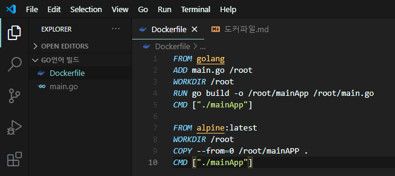

# Dockerfile

## 1. 이미지를 생성하는 방법
1. 아무 것도 존재하지 않는 이미지로 컨테이너를 생성
2. 애플리케이션을 위한 환경을 설치하고, 소스코드 들을 복사해 동작하는 것을 확인
3. 컨테이너를 이미지로 커밋
- 이 방법을 사용하면 애플리케이션이 동작하는 환경을 구성하기 위해 일일히 패키지를 설치하고 소스코드를 깃에서 복제하거나 호스트에서 복사해야 한다.
- 도커는 위와 같은 과정을 쉽게 기록하고 수행할 수 있는 빌드 명령어를 제공한다.
  - 완성된 이미지를 생성하기 위해 컨테이너에 설치해야 하는 패키지, 추가해야 하는 소스코드, 실행해야 하는 명령어와 셸 스크립트 등을 하나의 파일에 기록해두면 도커는 이 파일을 읽어 컨테이너에서 작업을 수행한 뒤 이미지로 만들어낸다.
- 이러한 작업을 기록한 파일을 이름을 **Dockerfile**이라 하며, 빌드 명령어는 Dockerfile을 읽어 이미지를 생성한다.
- 생성한 이미지를 도커 허브 들을 통해 배포할 때, 이미지 자체를 배포하는 대신 이미지를 생성하는 방법을 기록해 놓은 Dockerfile을 배포할 수 있다.

## 2. Dockerfile 작성
- Dockerfile에는 컨테이너에서 수행해야 할 작업을 명시한다.
- Dockerfile은 한 중이 하나의 명령어가 되고, 명령어를 명시한 뒤에 옵션을 추가한다.
  - 명령어는 일반적으로 대문자로 표기한다.

### 2.1. Dockerfile 명령어
- **FROM**
  - 생성할 이미지의 베이스가 될 이미지를 뜻한다.
  - Dockerfile을 작성할 때 반드시 한 번 이상 입력해야 한다.
  - 예) `FROM ubuntu:14.04`
- **MAINTAINER**
  - 이미지를 생성한 개발자의 정보를 나타낸다.
  - 1.13.0 버전 이후로 사용하지 않는다.
  - **LABEL maintainer**로 교체하여 표현한다.
  - 예) `LABEL maintainer "abc123 <abc123@naver.com>"`
- **LABEL**
  - 이미지에 메타데이터를 추가한다.
  - 메타데이터는 '키:값'의 형태로 저장되며, 여러 개의 메타데이터가 저장될 수 있다.
  - 추가된 메타데이터는 docker inspect 명령어로 이미지의 정보를 구해서 확인할 수 있다.
  - 예) `LABEL "purpose"="practice"`
- **RUN**
  - 이미지를 만들기 위해 컨테이너 내부에서 명령어를 실행한다.
  - 이미지를 빌드할 때 별도의 입력을 받아야 하는 RUN이 있다면 build 명령어는 이를 오류로 간주하고 빌드를 종료한다.
  - 때문에, Y/N와 같은 선택을 yes로 설정해야 한다.
  - JSON 배열의 형태로 사용할 수 있다
    - ["실행 가능한 차일", 명령줄 인자 1", "명령줄 인자 2", ...]
  - 예) `RUN apt-get install apache2 -y`
- **ADD**
  - 파일을 이미지에 추가한다.
  - 추가하는 파일은 Dockerfile이 위치한 디렉토리인 컨텍스트에서 가져온다.
  - JSON 배열의 형태로 사용할 수 있다.
    - ["추가할 파일 이름", ... , "컨테이너에 추가될 위치"]
    - 추가할 파일 이름은 여러 개를 지정할 수 있다.
  - 추가할 파일명은 여러 개를 지정할 수 있으며, 배열의 마지막 원소가 컨테이너에 추가될 위치다.
  - 예) `ADD test.html /var/www/html`
- **WORKDIR**
  - 명령어를 실행할 디렉토리를 나타낸다.
  - Bash Shell에서 cd 명령어를 입력하는 것과 같은 기능을 한다.
  - 예) `WORKDIR /var/www/html`
- **EXPOSE**
  - Dockerfile의 빌드로 생성된 이미지에서 노출할 포트를 설정한다.
  - 반드시 이 포트가 호스트의 포트와 바인딩되는 것은 아니며, 컨테이너의 80번 포트를 사용할 것임을 나타내는 것이다.
  - 예) `EXPOSE 80`
- **CMD**
  - 컨테이너가 시작될 때마다 실행할 커맨드를 설정하며, Dockerfile에서 한 번만 사용할 수 있다.
  - JSON 배열의 형태로 사용할 수 있다
    - ["실행 가능한 차일", 명령줄 인자 1", "명령줄 인자 2", ...]
  - 예) `CMD apachectl -DFOREGROUND`

## 3. Dockerfile 빌드

### 3.1. 이미지 생성
    docker build -t [생성될 이미지 이름] [도커파일 경로]
- -t 옵션을 사용하지 않으면, 16진수의 형태의 이름으로 이미지가 저장된다.
- 명령어의 끝에는 Dockerfile이 저장된 경로를 입력힌다.
- 예) `docker build -t mybuild:0.0 ./`
- 빌드 후, docker run 명령어를 입력해 이미지로 컨테이너를 생성한다.
- 예) `docker run -d -P --name myserver mybuild:0.0`
- `-P` (대문자) 옵션은 이미지에 설정된 EXPOSE의 모든 포트를 호스트에 연결하도록 설정한다.

### 3.2. 빌드 과정 살펴보기

#### 3.2.1. 빌드 컨텍스트
- 이미지 빌드를 시작하면 가장 먼저 빌드 컨텍스트를 읽는다.
- 빌드 컨텍스트는 이미지를 생성하는 데 필요한 각종 파일, 소스코드, 메타데이터 등을 담고 있는 디렉토리를 의미하며, Dockerfile이 위치한 디렉초리가 빌드 컨텍스트가 된다.
- 빌드 컨텍스트는 Dockerfile에서 빌드될 이미지에 파일을 추가할 때 사용된다.
- 컨텍스트는 build 명령어의 맨 마지막에 지정된 위치에 있는 파일을 전부 포함한다.
  - 따라서, Dockerfile이 위치한 것에는 이미지 빌드에 필요한 파일만 있는 것이 좋다.
- **.dockerignore**라는 파일을 작성하면 빌드 시 이 파일에 명시된 이름의 파일을 컨텍스트에서 제외한다.

##### 3.2.1.1. .dockerignore
- .dockerignore 파일은 컨텍스트의 최상위 경로, 즉 명령어에서 맨 마지막에 오는 경로인 Dockerfile이 위치한 경로와 같은 곳에 위치해야 한다.
- 컨텍스트에서 제외할 파일의 경로는 Dockerfile이 존재하는 경로를 기준으로 한다.
  - *.html은 현재 경로의 모든 html을 의미한다.
  - \*/\*.html은 현재 경로와 그 밑의 모든 html 파일을 의미한다.
- ?는 ? 자리에 임의의 한 자리 문자가 들어가는 파일을 제외한다는 의미다.
  - 예) test.htm?
- 제외 대상이지만 그 중 특수한 파일만 제외시키지 않으려면 !를 사용한다.
  - 예) !test*.html
  - test로 시작하는 html 파일은 컨텍스트에서 제외하지 않는다는 의미다.

#### 3.2.2. Dockerfile을 이용한 컨테이너 생성과 커밋
- 이미지를 빌드할 때 Dockerfile의 명령어가 실행될 때마다 새로운 컨테이너가 하나씩 생성되면 이를 이미지로 커밋한다.
  - 즉, Dockerfile에 적힌 명령어를 수행하고 다시 새로운 이미지 레이어로 저장된다.
- 따라서 이미지의 빌드가 완료되면 Dockerfile의 명령어 줄 수만큼의 레이어가 존재하게 되면, 중간에 컨테이너도 같은 수만큼 생성되고 삭제된다.

#### 3.2.3. 캐시를 이용한 이미지 빌드
- 한 번 이미지를 빌드를 마치고 난 뒤 가시 같은 빌드를 진행하면, 이전의 이미지 빌드에서 사용했던 캐시를 사용한다.
- 캐시를 사용하지 않으려면 build 명령어에 `--no-cache` 옵션을 추가한다.
- `--cache-from [이미지 이름]` 옵션으로 캐시로 사용할 이미지를 직접 지정할 수도 있다.

### 3.3. 멀티 스테이지를 이용한 Dockerfile 빌드하기
- 일반적으로 애플리케이션을 빌드할 때는 많은 의존성 패키지와 라이브러리를 필요로 한다.
  - 예를 들어. Go로 작성된 소스코드를 빌드하기 위해서는 Go와 관련된 빌드 툴과 라이브러리가 미리 설치되어 있어야 한다.
  
  - Go로 Hello, World! 소스코드를 작성한 뒤, Dockerfile을 사용하여 빌드하면 이미지의 크기가 800MB에 달한다.
  - 즉, 실제 실행 파일의 크기는 매우 작지만 소스코드 빌드에 사용된 각종 패키지 및 라이브러리가 불필요하게 이미지의 크기를 차지한다.
- 이미지의 크기를 줄이기 위해 **멀티 스테이지 빌드** 방법을 사용할 수 있다.
  - 하나의 Dockerfile 안에 여러 개의 FROM 이미지를 정의함으로써, 빌드 완료시 최종적으로 생성될 이미지의 크기를 줄이는 역할을 한다.
  
  - 두 번째 FROM 아래에서 사용된 COPY 명령어는 첫 번째 FROM에서 사용된 이미지의 최종 상태에 존재하는 /root/mainApp 파일을 두 번째 이미지인 alpine:latest에 복사한다.
  - 이 때 `--from=0`은 첫 번째 FROM에서 빌드된 이미지의 최종 상태를 의미한다.
  - 참고로, alpine은 크기가 매우 작지만 필수적인 런타임 요소가 포함되어 있는 이미지이다.

## 4. 기타 Dockerfile 명령어
- **ENV**
  - Dockerfile에서 사용될 환경변수를 지정한다.
  - 이 환경변수는 Dockerfile뿐 아니라 이미지에서 저장된다.
  - 예) `ENV test /home`
- **VOLUME**
  - 빌드된 이미지로 컨테이너를 생성했을 때 호스트와 공유할 컨테이너 내부의 디렉토리를 설정한다.
  - JSON 배열의 형태로 사용할 수 있다.
  - 예) `VOLUME /home/volume`
- **ARG**
  - build 명령어를 실행할 때 추가로 입력을 받아 Dockerfile 내에서 사용될 변수의 값을 설정한다.
  - 입력하는 형식은 '<키>=<값>'과 같이 쌍을 이루어야 한다.
  - 예) `ARG my_arg 혹은 ARG my_arg_2=value2`
- **USER**
  - 컨테이너 내에서 사용될 사용자 계정의 이름이나 UID를 설정하고, 그 아래의 명령어는 해당 사용자 권한으로 실행된다.
  - 일반적으로 RUN으로 사용자의 그룹과 계정을 생성한 뒤 사용한다.
  - 루트 권한이 필요하지 않다면 USER를 사용하는 것을 권장한다.
  - 예) 
    - `RUN groupadd -r author && useradd -r -g author gowns764`
    - `USER gowns764`
  - 기본적으로 컨테이너 내부에서는 root 사용자를 사용하도록 설정된다.
    - 이는 컨테이너가 호스트의 root 권한을 가질 수 있다는 것을 의미한다.
    - 때문에, 컨테이너 애플리케이션을 최종적으로 배포할 때는 컨테이너 내부에서 새로운 사용자를 새롭게 생성해 사용하는 것을 권장한다.
- 그 외는 'Dockerfile 레퍼런스' 참고

## 5. Dockerfile로 빌드할 때 주의할 점
- Dockerfile을 아무렇게나 작성하면, 저장 공간을 불필요하게 차지하는 이미지나, 레이어가 너무 많은 이미지가 생성될 수 있다.
- RUN 명령어로 파일을 삭제해도 파일을 삭제했다는 변경사항의 레이어로 새롭게 저장될 뿐, 실제 크기의 파일은 이전 레이어에 남아있다.
  - 즉, 컨테이너에서 사용하지 못하는 파일이 저장 공간을 차지한다.
- 이를 방지하기 위해 Dockerfile을 작성할 때 **&&**로 각 RUN 명령을 하나로 묶는다.
  - 즉, 하나의 RUN으로 여러 개의 명령어를 실행하도록 작성한다.
  - RUN이 하나의 이미지 레이어가 되기 때문이다.