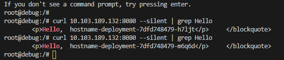

# 쿠버네티스 개념

## 1. 쿠버네티스의 특징
1. 모든 리소스는 **오브젝트** 형태로 관리된다.
   - 컨테이너의 집합(Pods), 컨테이너의 집합을 관리하는 컨트롤러(Replica Set), 사용자(service Account), 노드(Node) 등등 하나의 오브젝트로 사용할 수 있다.
   - `kubectl api-resources` 명령어로 쿠버네티스에서 사용할 수 있는 오브젝트들을 확인할 수 있다.
   - 특정 오브젝트에 대한 설명을 보려면 `kubectl expain [오브젝트 이름]` 명령어를 사용한다.
2. 쿠버네티스는 명령어로도 사용할 수 있지만, YAML 파일을 더 많이 사용한다.
   - 쿠버네티스에서 YAML 파일은 컨테이너뿐만 아니라 대부분의 리소스 오브젝트에 사용될 수 있다.
   - 컨테이너 자체, 컨테이너의 설정 값(ConfigMap), 비밀 값(Secrets) 등 모두 YAML 파일로 정의하여 사용한다.
   - 서비스를 배포할 때에도 kubectl 명령어가 아닌 여러 개의 YAML 파일을 정의하여 쿠버네티스에 적용시키는 방식으로 동작한다.
3. 쿠버네티스는 여러 개의 컴포넌트로 구성되어 있다.
   - 쿠버네티스 노드의 역할은 크게 마스터와 워커로 나뉜다.
     - 마스터 노드는 쿠버네티스가 제대로 동작할 수 있게 클러스터를 관리하는 역할을 담당한다.
     - 워커 노드에는 애플리케이션 컨테이너가 생성된다.
   - 쿠버네티스는 도커를 포함한 많은 컴포넌트들이 실행된다.
     - 예를 들어, 마스터 노드에는 API 서버, 컨트롤러 매니저, 스케줄러, DNS 서버 등이 실행된다.
     - 컴포넌트들은 기본적으로 도커 컨테이너로서 실행된다.
     - 쿠버네티스 클러스터 구성을 위해 **kubelet**이라는 에이전트가 모든 노드에서 실행된다.

## 2. 포드(Pod) : 컨테이너를 다루는 기본 단위

### 2.1. 포드 사용하기
- 쿠버네티스에서는 컨테이너 애플리케이션의 기본 단위를 포드(Pod)라고 부르며, 포드는 1개 이상의 컨테이너로 구성된 컨테이너의 집합이다.
- 쿠버네티스의 YAML 파일은 일반적으로 apiVersion, kind, metadata, spec 네 가지 항목으로 구성된다.
  - **apiVersion**
    - YAML 파일에서 정의한 오브젝트의 API 버전을 나타낸다.
  - **kind**
    - 리소스의 종류를 나타낸다.
    - kind 항목에서 사용할 수 있응 리소스 오브젝트 종류는 kubectl api-resources 명령어릐 KIND 항목에서 확인할 수 있다.
  - **metadata**
    - 라벨, 주석, 이름 등과 같은 리소스의 부가 정보들을 입력한다.
  - **spec**
    - 리소스를 생성하기 위한 자세한 정보를 입력한다.
- 작성한 YAML 파일은 `kubectl apply -f [YAML 파일 이름]` 명령어로 쿠버네티스에 생성할 수 있다.
- `kubectl get [오브젝트 이름]` 명령어로 특정 오브젝트의 목록을 확인할 수 있다.
- `kubectl describe [오브젝트 이름]` 명령어로 생성된 리소스의 자세한 정보를 출력할 수 있다.
  - 예를 들어, `kubectl describe pods [포드 이름]` 명령어로 포드의 자세한 정보를 볼 수 있다.
- `kubectl logs [오브젝트 이름]` 명령어로 오브젝트의 표준 출력 로그를 확인할 수 있다.
- `kubectl delete -f [YAML 파일]` 또는 `kubectl delete pod [포드 이름]` 명령어로 오브젝트를 삭제할 수 있다.

### 2.2. 포드 vs 도커 컨테이너
- 포드는 여러 리눅스 네임스페이스를 공유하는 여러 컨테이너들을 추상화된 집합으로 사용한다.
  - 예를 들어, YAML 파일에 컨테이너를 여러 개 작성하고 서버 컨테이너를 실행하지 않아도 다른 컨테이너에서 서버 컨테이너로 접근이 가능하다.
    - 포드 내의 컨테이너들이 네트워크 네임스페이스 등과 같은 리눅스 네임스페이스를 공유하여 사용하기 때문이다.
    - 네트워크 네임스페이스는 컨테이너의 고유한 네트워크 환경을 제공해주는 역할을 한다.

### 2.3. 완전한 애플리케이션으로서의 포드
- 쿠버네티스 환경에서는 1개의 컨테이너로 구성된 포드를 사용하는 경우가 많다.
- 하나의 포드는 하나의 완전한 애플리케이션이다.
- 그러나, 컨테이너가 실행되기 위해 부가적인 기능을 필요로 한다면 기능 확장을 위해 추가 컨테이너를 함께 포드에 포함시킬 수 있다.
  - 포드에 정의된 부가적인 컨테이너를 **사이드카(sidecar) 컨테이너**라고 한다.
  - 사이드카 컨테이너는 포드 내의 다른 컨테이너와 네트워크 환경 등을 공유한다.
  - 때문에 포드에 포함된 컨테이너들은 모두 같은 워커 노드에서 실행된다.

## 3. 레플리카셋(Replica Set) : 일정 개수의 포드를 유지하는 컨트롤러

### 3.1. 레플리카셋을 사용하는 이유
- YAML 파일에에 포드만 정의하여 생성하면 포드를 삭제할 때 그 포드의 컨테이너도 삭제된다.
  - 즉, 이러한 포드는 쿠버네티스 사용자에 의해서만 관리된다.
  - 마이크로 서비스 구조의 포드에서 이러한 방식을 사용하기 어렵다.
    - 여러 개의 동일한 컨테이너를 생성한 뒤 외부 요청이 각 컨테이너에 적절히 분배될 수 있어야 한다.
- 여러 개의 포드를 직접 생성하는 것은 적절하지 않다.
  - 동일한 포드의 개수가 많아질 수록 일일히 YAML 파일에 정의하는 것은 비효율적이다.
  - 포드가 어떠한 이유로든 삭제되거나, 포드가 위치한 노드에 장애가 발생하여 더 이상 포드에 접근하지 못하게 되었을 때, 직접 포드를 삭제하고 다시 생성하지 않는 한 해당 포드는 다시 복구되지 않는다.
- 예를 들어, `kubectl get pods -o wide` 명령어로 포드가 실행 중인 워커 노드를 확인한 뒤, 직접 워커 노드 서버를 종료해도 포드는 다른 노드에서 다시 생성되지 않으며, 종료 상태로만 남아있다.
- 쿠버네티스에서 포드만 정의하여 사용하는 경우는 거의 없으며, 레플리카셋이라는 쿠버네티스 오브젝트를 함께 사용하는 것이 일반적이다.
- 레플리카셋은 정해진 수의 동일한 포드가 항상 실행되도록 관리하며, 노드 장애 들의 이유로 포드를 사용할 수 없다면 다른 노드에서 포드를 다시 생성한다.
  - 따라서, 동일한 포드를 안정적으로 여러 개 실행할 수도 있고, 워커 노드에 장애가 생기더라도 정해진 개수의 포드를 유지할 수 있다.

### 3.2. 레플리카셋 사용하기
1. 레플리카셋을 사용하기 위해 YAML 파일을 작성한다.
   - **spec.replicas**
     - 동일한 포드를 몇 개 유지시킬 것인지를 설정한다.
   - **spec.template**
     - 포드를 생성할 때 사용할 탬플릿을 정의한다.
2. 레플리카셋을 생성한다.
   - `kubectl apply -f [YAML 파일 이름]`
3. `kubectl delete -f [YAML 파일]` 또는 `kubectl delete rs [레플리카셋 이름]` 명령어로 레플리카셋을 삭제할 수 있다.

### 3.3. 레플리카셋의 동작 원리
- 레플리카셋과 포드는 느슨한 연결을 유지하고 있으며, 레플리카셋의 정의 중 **라벨 셀렉터**를 이용하여 이루어진다.
- YAML 파일에서 metadata 항목에 라벨을 설정할 수 있다.
- 라벨은 서로 다른 오브젝트가 서로를 찾아야 할 때 사용되기도 한다.

## 4. 디플로이먼트(Deployment) : 레플리카셋, 포드의 배포를 관리

### 4.1. 디플로이먼트 사용하기
- 일반적으로, 레플리카셋과 포드의 정보를 정의하는 **디플로이먼트**라는 오브젝트를 YAML 파일에 정의하여 사용한다.
- 디플로이먼트는 레플리카셋의 상위 오브젝트이기 때문에 디플로이먼트를 생성하면 해당 디플로이먼트에 대응하는 레플리카셋도 함께 생성된다.
  - 따라서, 디플로이먼트를 사용하면 포드와 레플리카셋을 직접 생성할 필요가 없다.
1. YAML 파일의 kind 항목을 Dployment로 설정한다.
2. `kubectl apply -f [YAML 파일 이름]` 명령어로 디플로이먼트를 생성한다.
3. `kubectl get deployment` 명령어로 생성된 디플로이먼트의 목록을 출력할 수 있다.
   - deployment는 deploy로 줄일 수 있다.
4. `kubectl delete deploy [디플로이먼트 이름]` 명령어로 디플로이를 삭제할 수 있다.
   - 디플로이먼트를 삭제하면 레플리카셋과 포드도 함께 삭제된다.

### 4.2. 디플로이먼트를 사용하는 이유
- 애플리케이션의 업데이트와 배포를 더욱 편하게 만든다.
  - 디플로이먼트는 컨테이너 애플리케이션을 배포하고 관리하는 역할을 담당한다.
    - 애플리케이션을 업데이트할 때 레플리카셋의 변경 사항을 저장하는 리비전을 남겨 롤백을 가능하게 해준다.
    - 무중간 서비스를 위해 포드의 롤링 업데이트의 전략을 지정할 수 있다.
      - `kubectl set image deployment [디플로이먼트 이름] [이미지 이름]=[이미지 이름]:[버전] --record` 명령어로 포드의 이미지의 버전을 업데이트할 수 있다.
      - `kubectl rollout history deployment [디플로이먼트 이름]` 명령어로 리비전 정보를 확인할 수 있다.
        - `--record=true` 옵션으로 디플로이먼트를 변경하면 변경 사항을 디플로이먼트에 기록함으로써 해당 버전의 레플리카셋을 보존한다.
        - --record 옵션을 사용하지 않아도 이전의 레플리카셋을 보존되지만, 어떤 명령어를 통해 변경되었는지 기록하는 CHANGE-CAUSE 항목에 \<NONE\>으로 표시된다.
      - `kubectl rollout undo deployment [디플로이먼트 이름] --to-revision=[리비전 번호]` 명령어로 해당 리비전 번호의 레플리카셋으로 롤백할 수 있다.
      - `ubectl describe deployment [디플로이먼트 이름]` 명령어로 디플로이먼트의 정보를 출력할 수 있다.
        - 현재의 레플리카셋 리비전 정보와 활성화된 레플리카셋 이름을 확인할 수 있다.

## 5. 서비스(Service) : 포드를 연결하고 외부에 노출
- kubectl decribe 명령어로 포드의 내부 IP를 직업 확인하고 포드로 접근할 수 있지만, 로컬 개발 환경이나 쿠버네티스 클러스터 내부에서만 사용할 수 있는 방법이다.
  - 포드의 IP는 유동적이다.
- 쿠버네티스는 디플로이먼트를 생성할 때 포드를 외부로 노출하지 않으며, 디플로이먼트의 YAML 파일에는 단지 포드의 애플리케이션이 사용할 내부 포트만 정의한다.
  - YAML 파일 내의 **containerPort** 항목이 바로 그것이다.
- YAML 파일에서 containerPort 항목을 정의했다고 헤서 이 포드가 바로 외부로 노출되는 것은 아니다.
  - 포트를 외부로 노출하여 사용자들이 접근하거나, 다른 디플로이먼트의 포드들이 내부적으로 접근하려면 **서비스**라고 부르는 별도의 쿠버네티스 오브젝트를 생성해야 한다.
  - 서비스의 핵심 기능
    - 여러 개의 포드에 쉽게 접근할 수 있도록 고유한 도메인 이름을 부여한다.
    - 여러 개의 포드에 접근할 때 요청을 분산하는 로드 밸런서 기능을 수행한다.
    - 클라우드 플랫폼의 로드 밸런서, 클러스터 노드의 포트 들을 통해 포드를 외부로 노출한다.

### 5.1. 서비스의 종류
- 서비스의 종류에 따라 포드에 접근할 수 있는 방법이 달라진다.
- 주로 사용하는 서비스 타입은 크세 3가지이다.
  - **ClusterIP 타입**
    - 쿠버네티스 내부에서만 포드들에 접근할 때 사용한다.
    - 외부로 포드를 노출하지 않기 때문에 쿠버네티스 클로스터 내부에서만 사용되는 포드에 적합하다.
  - **NodePort 타입**
    - 포드에 접근할 수 있는 포드를 클러스터의 모든 노드에 동일하게 개방한다.
    - 외부에서 포드에 접근할 수 있는 서비스 타입이다.
    - 접근할 수 있는 포트는 랜덤으로 정해지지만, 특정 포트로 접근하도록 설정할 수도 있다.
  - **LoadBalancer 타입**
    - 클라우드 플랫폼에서 제공하는 로드 밸런서를 동적으로 프로비저닝해 포드에 연결한다.
    - 외부에서 포드에 접근할 수 있는 서비스 타입이다.
    - 일반적으로 AWD=S, GCP 등과 같은 클라우드 플랫폼 환경에서만 사용할 수 있다.

### 5.2. ClusterIP 타입의 서비스 - 쿠버네티스 내부에서만 포드에 접근하기
```yaml
apiVersion: v1
kind: Service
metadata:
  name: hostname-svc-clusterip
spec:
  ports:
  - name: web-port
    port: 8080
    targetPort: 80
  selector:
    app: webserver
  type: ClusterIP
```
- 서비스를 정의하는 YAML 파일의 항목
  - **spec.selector**
    - 이 서비스에서 어떠한 라벨을 가지는 포드에 접근할 수 있게 만들 것인지를 결정한다.
  - **spec.ports.port**
    - 생성된 서비스는 쿠버네티스 내부에서만 사용할 수 있는 고유한 IP(ClusterIP)를 할당받는다.
    - port 항목에는 서비스의 IP에 접근할 때 사용할 포트를 설정한다.
  - **spec.ports.targetPort**
    - selctor 항목에서 정의한 라벨에 의해 접근 대상이 된 포트들이 내부적으로 사용하고 있는 포트룰 입력한다.
    - 즉, 포트 템플릿에 정의된 containerPort와 같은 값으로 설정해야 한다.
  - **spec.type**
    - 이 서비스가 어떤 타입인지 나타낸다.
- `kubectl get services` 명령어로 생성된 서비스의 목록을 확인할 수 있다.
  - kubernetes라는 이름의 서비스는 미리 생성되어 있다.
  - 이 서비스는 포트 내부에서 쿠버네티스의 API에 접근하기 위한 서비스이다.
- 임시 포드를 만들어 요청을 전송해보면, 서비스와 연결된 여러 개의 포드에 자동으로 요청이 분산된다.
  - 즉, 서비스를 생성할 때 별도의 설정을 하지 않아도 서비스는 연결된 포드에 대해 로드 밸런싱을 수행한다.

- 서비스에는 IP뿐만 아니라 서비스 이름 그 자체로도 접근할 수 있다.
  - 쿠버네티스는 애플리케이션이 서비스나 포드를 쉽게 찾을 수 있도록 내부 DNS를 구동하고 있으며, 포드들은 자동으로 이 DNS를 사용하도록 설정된된다.
- 서비스를 삭제하려면 `kubectl delete service [서비스 이름]` 명령어를 사용한다.